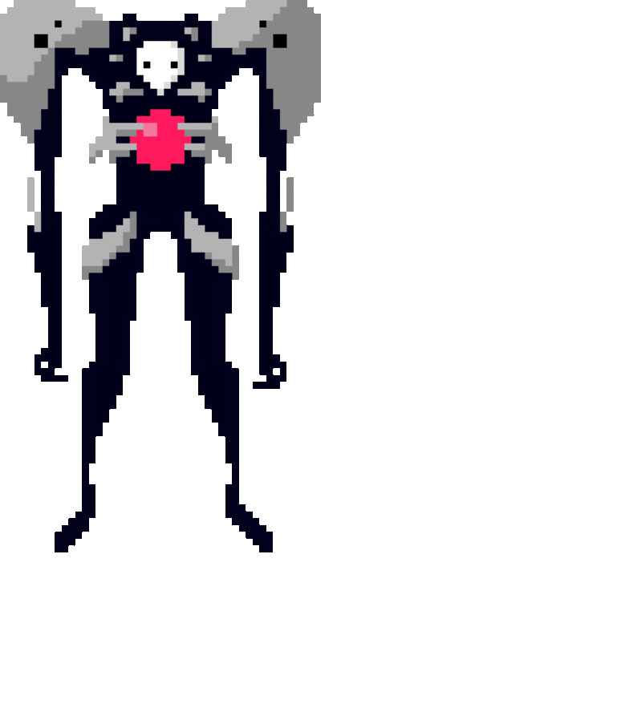

# Introducción 📖
Se propone realizar un programa que añada puntos casi blancos a un fondo blanco y puntos casi negros a un fondo negro, usar la máscara de detección de puntos aislados para resaltarlos, pero antes de comenzar:

## ¿Qué es el procesamiento digital de imagenes (PDI)? 🤷‍♂️🤷‍
PDI se puede definir como el conjunto de procesamientos que se realizan sobre una imagen digital ya sea para realizar su almacenamiento, transmisión o tratamiento.

## Lectura de imágenes en matlab 👓
Para leer una imágen en matlab se utiliza la función <a href="https://la.mathworks.com/help/matlab/ref/imread.html"> **imread**</a> y se asigna a una variable que representara a la imágen.

<h5 align="center"><code>imagen = imread('ruta/nombre de la imágen.extensión');</code></h5>

## MASCARA PARA DETECTAR PUNTOS AISLADOS 👹
Supongamos que una imagen de intensidad constante que contiene puntos aislados cuyas intensidades difieren considerablemente del fondo. Estos puntos pueden detectarse usando una máscara 3x3 con los siguientes valores:

<table ALIGN="right">
<td>-1</td>
<td>-1</td>
<td>-1</td>
<tr>
<td>-1</td>
<td>8</td>
<td>-1</td>
<tr>
<td>-1</td>
<td>-1</td>
<td>-1</td>
</table>

En cada posición de la imagen ,ultiplicamos cada punto que está contenido en la imagen por su correspondiente coeficiente de la máscara; es decir, el pixel que etsá en el cento de la máscara es multiplicado por 8, mientras que susn 8 vecinos se multiplican por -1

El resultado de estas 9 ,ultiplicaciones se suma. Si todos los puntos bajo la máscara tienen el mismo valor de intensidad (**backfround constante**), la suma será cero.

Pero si el centro de la máscara se ha colocado en un punto aislado de una intensidad diferente a su fondo, la mascara será diferente de cero.

### Resultados ⚗🧪

Se propuso usar 2 imagenes pixeleadas (Pixelart) para cada fondo, estas imagenes fueron redimensionadas y añadidas a los fondos Blanco (255) y Negro (0), para lograr una mejor visión se recomienda cambiar las líneas 9 y 24 por valores mayores y menores respectivamente  

~~~
%Abrir imagen 1
seB=imread('IMG/1A.png');
[f c d]=size(seB);
seB=imresize(seB,[270 280]);
seB=rgb2gray(seB);
for i=1:270
    for j=1:280
        if seB(i,j)~=0
            seB(i,j)=1;
        else
            seB(i,j)=0;
        end
    end
end

%Abrir imagen 2
seW=imread('IMG//E1.png');
[f1 c1 d1]=size(seW);
seW=imresize(seW,[270 280]);
%seW=rgb2gray(seW);
for i=1:270
    for j=1:280
        if seW(i,j)~=0
            seW(i,j)=254;
        else
            seW(i,j)=255;
        end
    end
end
~~~

Las siguientes imagenes usan valores de 5 y 250 respectivamente, tambien se muestran las imagenes añadidas al fondo.

<a href="https://github.com/ArturoEmmanuelToledoAguado/Puntos_Aislados/blob/main/Puntos_Aislados.m">Código</a>